<div align="center">



</div>

<br/>

<div align="center">

</div>

<br/>

## AI Model Card

<table width="100%">
<tr>
<td width="50%" valign="top">

```
Model Name       Vaishnavi-v2
Architecture     Human + Curiosity + Engineering
Status           Actively training on production systems
```

**Capabilities**
- Backend Engineering
- AI Engineering
- Full Stack Development
- System Design
- Cloud Development

</td>
<td width="50%" valign="top">

```
Learning Strategy
```

- Research
- Building
- Open Source
- Problem Solving

**Education**
B.E. in Computer Engineering — CGPA 9.19

</td>
</tr>
</table>

<br/>

## Live Status

<table width="100%">
<tr>
<td width="33%" valign="top">

**STATUS**
🟢 `ONLINE`

**Location**
India

</td>
<td width="33%" valign="top">

**Current Mission**
Building AI Applications

**Current Focus**
LLMs · FastAPI · Docker · Cloud

</td>
<td width="34%" valign="top">

**Availability**
`Open to Opportunities`

**Response Time**
~ 24h

</td>
</tr>
</table>

<br/>

## Tech Stack

<div align="center">

</div>

<br/>

<table width="100%">
<tr>
<td valign="top" width="25%">

**Core CS**
- DSA
- OOP
- Operating Systems
- DBMS
- Computer Networks
- System Design

</td>
<td valign="top" width="25%">

**Frontend / Backend**
- React · Next.js
- Node.js · Express.js
- FastAPI
- Microservices

</td>
<td valign="top" width="25%">

**AI**
- LLMs · RAG
- AI Agents
- LangChain
- Prompt Engineering
- OCR · NLP

</td>
<td valign="top" width="25%">

**Databases / Cloud**
- PostgreSQL · MongoDB · MySQL
- Redis · SQLite · Vector DBs
- Docker · Linux · AWS
- Git · GitHub Actions · Jenkins · Nginx

</td>
</tr>
</table>

<br/>

## Featured Projects

<table width="100%">
<tr>
<td width="50%" valign="top">

### 🧠 Paper2Prototype AI

Converts research papers into working software prototypes, bridging the gap between academic research and deployable systems.

**Stack:** Python · LLMs · FastAPI · RAG

**Highlights**
- Automated pipeline from paper → structured spec → prototype
- Retrieval-augmented parsing for technical documents
- Designed for rapid iteration on research-to-product workflows

[`GitHub`](#) &nbsp;·&nbsp; [`Live Demo`](#)

</td>
<td width="50%" valign="top">

### ⚡ FlowPilot AI

An AI-assisted workflow automation system for orchestrating multi-step tasks and agentic pipelines.

**Stack:** Python · LangChain · FastAPI · Docker

**Highlights**
- Agent-based orchestration for complex task chains
- Modular architecture for pluggable AI tools
- Built for reliability in production environments

[`GitHub`](#) &nbsp;·&nbsp; [`Live Demo`](#)

</td>
</tr>
</table>

<br/>

## Current Mission

```
[ MISSION LOG ]

 ▸ Build production-grade AI systems           [ IN PROGRESS ]
 ▸ Research LLMs                                [ IN PROGRESS ]
 ▸ Design scalable backend systems              [ ACTIVE ]
 ▸ Create developer tools                       [ ACTIVE ]
 ▸ Learn distributed architectures              [ ONGOING ]
```

<br/>

## Achievements

- Recognized for consistent performance in **hackathons and coding competitions**
- Engineering Intern at **Qualys** — applied production engineering practices at scale
- Research Intern at **College of Military Engineering (CME)** — applied research in engineering systems
- Maintained a **9.19 CGPA** through a rigorous Computer Engineering curriculum

<br/>

## Roadmap

<div align="center">

</div>

<br/>

## Now Learning

| | |
|---|---|
| 📡 | Large Language Models |
| 🔌 | Model Context Protocol |
| 🌐 | Distributed Systems |
| ☁️ | Cloud Native AI |

<br/>

## GitHub Stats

<div align="center">


<br/>


<br/><br/>


</div>

<!--
  Contribution snake — requires a scheduled GitHub Action in this repo
  (platane/snk) writing to assets/snake.svg. See setup note at bottom of README.
-->
<div align="center">

</div>

<br/>

<div align="center">

</div>

<br/>

## Connect

<div align="center">

</div>

<br/>

<div align="center">

`Python` · `FastAPI` · `LLMs` · `Docker` · `Next.js` · `AWS` · `PostgreSQL`

<br/>

**Vaishnavi Dalal** — Building at the intersection of AI and production engineering.

</div>
